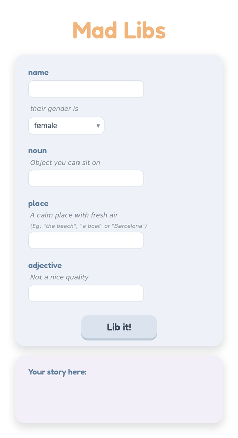

# Mad-Libs

Webpage that allows the user to play a game of Mad-Libs, developed using **HTML** and **JavaScript**

## Why

> Showcase of the use of JavaScript to develop an interactive page through the use of a form.

> To practice:
>
>  - The use of **DOM variables** and **event listener functions**
>  - Modification of the DOM elements
>  - Processing **forms with events**
>  - Modification of the style of the page through the use of **JavaScript**
>  - Git and GitHub **version control**

## Roadmap

### *Features*

> - [x] **First steps:** First version of the page with minimal styling
> - [x] **Layout design**
> - [x] **HTML boxes**. Structure of the content
> - [x] **CSS positioning**
> - [x] **CSS styling**

### *Enhancements*

> - [x] **Filler words in the story**
> - [ ] **Re-start button**
> - [ ] **Dynamic design with every question in a different card**
> - [ ] **Addition of the new *hidden* elements in HTML**
>    - [ ] Box elements
>    - [ ] Buttons
> - [ ] **DOM manipulation** to create the transition effect

## Layouts

### Design 01

